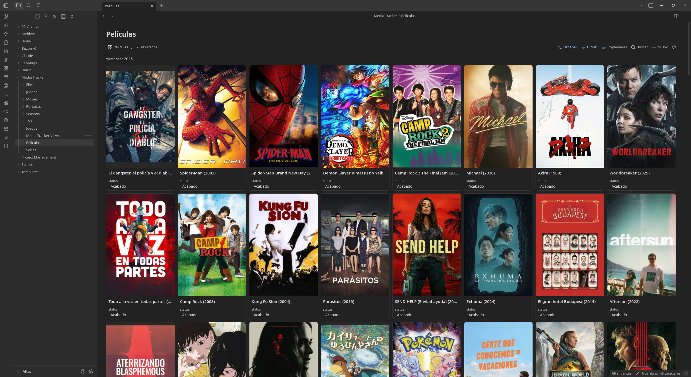
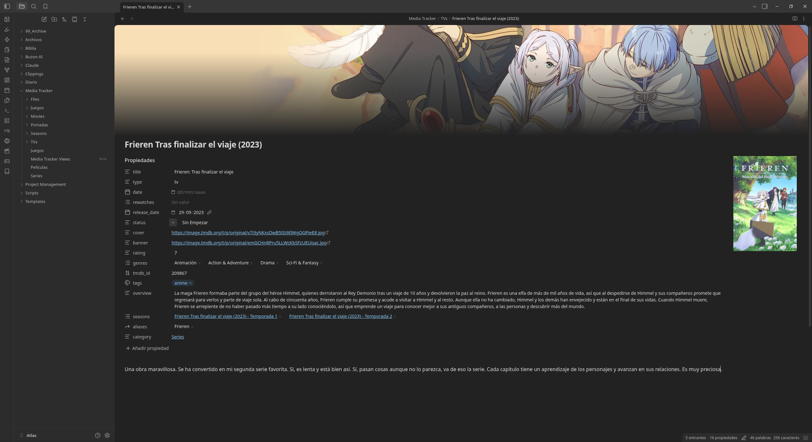
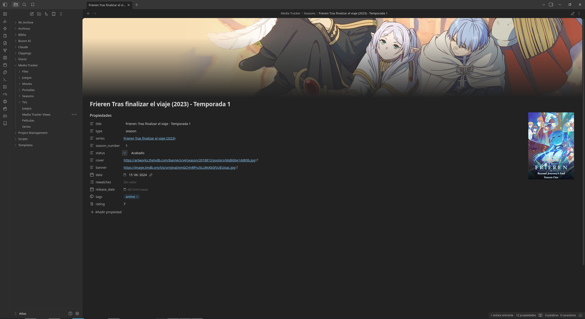
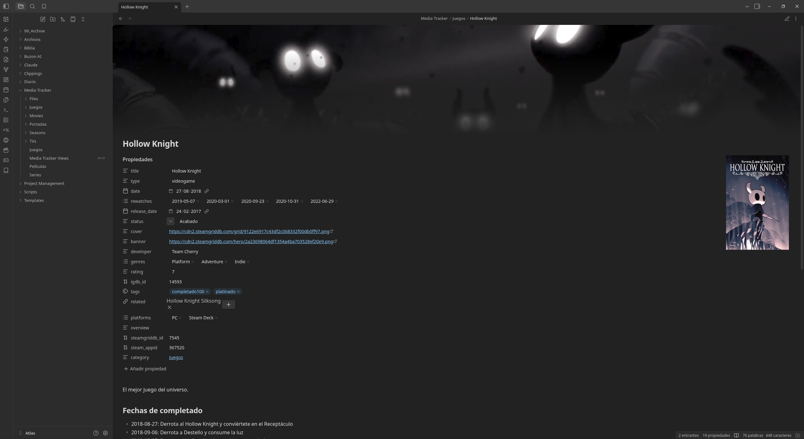

# Media Tracker

[](https://ko-fi.com/christt105)

An Obsidian plugin to track movies, TV shows, seasons, video games, and books. It fetches metadata and artwork from TMDB, TheTVDB, IGDB, Steam, SteamGridDB, and Open Library to create customizable notes in your vault.

This plugin replaces the QuickAdd, Templater, and Movie Search script bundle from the [Media Tracker Obsidian Template](https://github.com/christt105/media-tracker-obsidian-template). Everything is handled directly inside Obsidian with native settings, requiring no extra scripts or dependencies.

## Ecosystem

This plugin can be paired with a Hugo site to publish your media library online:

- [mediatracker-starter](https://github.com/christt105/mediatracker-starter): A ready-to-clone Hugo site template for GitHub Pages. Point this plugin at its `content/` folder to populate your site ([live demo](https://christt105.github.io/mediatracker-starter/)).
- [hugo-mediatracker-theme](https://github.com/christt105/hugo-mediatracker-theme): Hugo theme that renders the media library (gallery, search, filters, stats, RSS).
- **obsidian-mediatracker-plugin** (this repo): The Obsidian plugin that creates theme-compatible notes.

## Features

- **Movies & TV shows**: Search TMDB or TheTVDB to generate notes with posters, banners, genres, cast, director, and overview. Select a provider per media type; IDs from both services are stored so artwork can be pulled from either source.
- **TV season numbering**: TheTVDB handles season numbering accurately, useful for anime and split-cour shows.
- **Video games**: Search IGDB to create notes with covers, screenshots, banners, developers, platforms, genres, and Steam App IDs. Steam artwork is fetched automatically when available.
- **Books**: Search Open Library (no API key needed) to pull covers, authors, publishers, page counts, genres, ISBNs, and synopses.
- **Season notes**: Generate a linked season note directly from an active TV show note. Pulls season air dates and posters while referencing the parent show note.
- **Image selection**: Update covers or banners from a visual gallery. Supports TMDB, TheTVDB, Steam, and SteamGridDB, with automatic fallback across providers.
- **Steam App ID lookup**: Search and save `steam_appid` directly to the active note.
- **Customizable configuration**: Configure target folders, file naming rules, default status, frontmatter key case (`snake_case` / `camelCase`), season labels, and custom templates per media type.

## Commands

| Command | Description |
| --- | --- |
| **Add movie or TV show** | Search TMDB or TheTVDB and create a note. |
| **Add video game** | Search IGDB and create a note. |
| **Add book** | Search Open Library and create a note. |
| **Create season (from active show note)** | Create a season note linked to the open TV show. |
| **Search Steam App ID (for active note)** | Find and store `steam_appid`. |
| **Update images (cover / banner)** | Select a new cover or banner for the active note. |
| **Create media views (Bases gallery & table)** | Generate a `.base` file with default gallery and table views. |

The plugin adds three ribbon icons for quick access: *Add movie or TV show*, *Add video game*, and *Add book*. You can assign custom hotkeys in **Settings → Hotkeys** (search for "Media Tracker").

## Setup

Configure API keys under **Settings → Media Tracker**. Movies, TV shows, and books work without any initial key configuration (TMDB, TheTVDB, and Open Library work by default). API keys are only required for IGDB (games) and SteamGridDB (additional artwork), or if you want to use custom TMDB/TheTVDB API keys.

### Providers

Select your preferred metadata providers for movies and TV shows:

- **Movie provider** and **TV show provider**: Set to *Auto*, *TMDB*, or *TheTVDB*.
- *Auto* defaults to TMDB for movies and TheTVDB for TV shows if both are available, or whichever key is configured.
- Combined search queries both sources and merges results when both providers are used.

Both `tmdb_id` and `thetvdb_id` are saved to notes when available, allowing image updates from either provider.

### TMDB (movies & TV shows)

Works out of the box using a shared key. If you encounter rate limits, you can provide a custom API key:

1. [Create a TMDB account and request an API key](https://www.themoviedb.org/settings/api).
2. Enter your **v3 API key** or **v4 read access token** into *TMDB API key*.

### TheTVDB (TV shows & seasons)

Works out of the box using a project key. To use a custom key:

1. Register a project at [TheTVDB API information](https://www.thetvdb.com/api-information).
2. Enter your **v4 API key** into *TheTVDB API key*. If using a user-supported key, enter your **subscriber PIN**.

Authentication tokens are refreshed automatically. Metadata is localized to your preferred locale with fallbacks to English and the original language.

### IGDB (video games)

1. Log in to the [Twitch developer console](https://dev.twitch.tv/console/apps).
2. Register an application:
   - **OAuth Redirect URL:** `http://localhost`
   - **Category:** Application Integration
   - **Client Type:** Confidential
3. Copy the **Client ID** and **Client Secret** into settings.

OAuth tokens are fetched and refreshed automatically.

### SteamGridDB (artwork)

Generate an API key from [SteamGridDB preferences](https://www.steamgriddb.com/profile/preferences/api) and paste it into *SteamGridDB API key*. Used by the **Update images** command for video game artwork.

### Open Library (books)

Works out of the box through [Open Library](https://openlibrary.org/). No API key is required.

**Languages**: Search results and covers filter by your preferred locale (configured in TMDB settings) when localized editions exist. Synopsis text is retrieved from the work level and is usually in English.

## Customization

| Setting | Description |
| --- | --- |
| Media folders | Output folder for each media type. |
| File name format | Naming pattern using `{{title}}`, `{{year}}`, `{{release_date}}` placeholders. |
| Default status | Default status value assigned to new notes (e.g., `Not Started`). |
| Frontmatter property case | Key formatting style (`snake_case` or `camelCase`). |
| Seasons list property | Note property used to list season links on TV show notes. |
| Season label | Prefix word for season note file names (`Season`, `Temporada`, etc.). |
| Custom templates | Optional Markdown template files per media type. |

### Custom templates

If template paths are empty, the plugin uses built-in frontmatter defaults compatible with the Hugo theme. You can specify a custom note template for any media type using `{{variable}}` placeholders. Array fields are formatted as comma-separated lists.

Available variables: `title`, `original_title`, `type`, `release_date`, `year`, `overview`, `cover`, `banner`, `genres`, `rating`, `tmdb_id`, `director`, `main_actors`, `homepage`, `tagline`, `youtube_url`, `number_of_seasons`, `thetvdb_id`, `igdb_id`, `steam_appid`, `steamgriddb_id`, `developer`, `available_platforms`, `game_modes`, `season_number`, `series_file`, `openlibrary_id`, `author`, `authors`, `publisher`, `isbn`, `page_count`.

> [!NOTE]
> For games, `available_platforms` lists platform availability from IGDB. The `platforms` property is left blank so you can track the specific platform you used.

## Generated frontmatter

Notes are created with frontmatter compatible with the Media Tracker Hugo theme, e.g. a movie:

```yaml
---
title: Back to the Future
type: movie
date: ""
rewatches: []
release_date: "1985-07-03"
status: Not Started
cover: https://image.tmdb.org/t/p/original/...jpg
banner: https://image.tmdb.org/t/p/original/...jpg
rating: ""
genres:
  - Adventure
  - Comedy
  - Science Fiction
tmdb_id: 105
tags: []
related: []
overview: "Eighties teenager Marty McFly..."
---
```

and a book:

```yaml
---
title: The Hobbit
type: book
date: ""
rewatches: []
release_date: "1937"
status: Not Started
cover: https://covers.openlibrary.org/b/id/14627509-L.jpg
rating: ""
genres:
  - Fantasy
author: J.R.R. Tolkien
page_count: 310
publisher: Del Rey Books
openlibrary_id: OL27482W
isbn: "9780007525492"
tags: []
related: []
overview: "The Hobbit is a tale of high adventure, undertaken by a company of dwarves..."
---
```

## Installation

### Via BRAT

[BRAT](https://github.com/TfTHacker/obsidian42-brat) can install and update the plugin directly from GitHub:

1. Install and enable **BRAT** from *Settings → Community plugins → Browse*.
2. Run the command **BRAT: Add a beta plugin for testing** (or open *Settings → BRAT → Add Beta Plugin*).
3. Enter `christt105/obsidian-mediatracker-plugin` and submit.
4. Enable **Media Tracker** in *Settings → Community plugins*.

> Requires Obsidian 1.6.6 or later.

### Manual installation

1. Download `main.js`, `manifest.json`, and `styles.css` from the [latest release](https://github.com/christt105/obsidian-mediatracker-plugin/releases).
2. Place the files into `<vault>/.obsidian/plugins/media-tracker/`.
3. Reload Obsidian and enable **Media Tracker** in *Settings → Community plugins*.

## Recommended companion plugins

- [Pretty Properties](https://obsidian.md/plugins?id=pretty-properties): Renders `cover` and `banner` image properties directly in notes.
- [Bases](https://help.obsidian.md/bases) (core plugin): Run **Create media views** to generate a `.base` file with gallery and table views of your library.

## Screenshots

| Library View | TV Show Note |
| :---: | :---: |
|  |  |

| TV Season Note | Video Game Note |
| :---: | :---: |
|  |  |

## Development

```bash
npm install
npm run dev      # watch + rebuild
npm run build    # type-check + production build
npm run lint     # eslint (obsidianmd ruleset)
```

### Releasing

Releases are automated via GitHub Actions (`.github/workflows/release.yml`). To release a new version:

```bash
npm version patch   # updates manifest.json + versions.json via version-bump.mjs
git push --follow-tags
```

Pushing a tag triggers a build and creates a draft GitHub release with `main.js`, `manifest.json`, and `styles.css` attached.

## Credits

- [Movie Search](https://github.com/Gubchik123/obsidian-movie-search-plugin) by Gubchik123: TMDB integration patterns, token handling, and settings layout inspiration.
- [obsidian-sample-plugin](https://github.com/obsidianmd/obsidian-sample-plugin): Project scaffolding and build configuration.
- QuickAdd / Templater scripts from the [Media Tracker Obsidian Template](https://github.com/christt105/media-tracker-obsidian-template) (IGDB script originally by christt105 / Elaws).

## Attribution

This project uses data and images from:

- [The Movie Database (TMDB)](https://www.themoviedb.org/)
- [TheTVDB](https://www.thetvdb.com/)
- [IGDB](https://www.igdb.com/)
- [Steam](https://store.steampowered.com/)
- [SteamGridDB](https://www.steamgriddb.com/)
- [Open Library](https://openlibrary.org/)

## License

[MIT](LICENSE)
